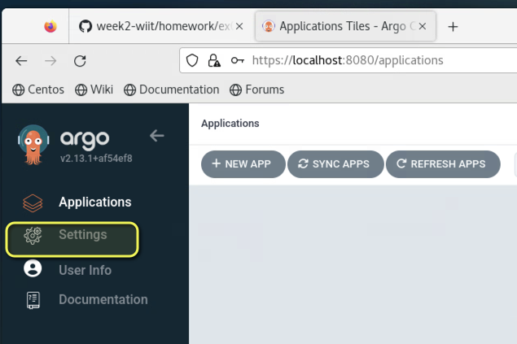
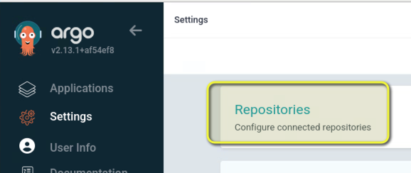
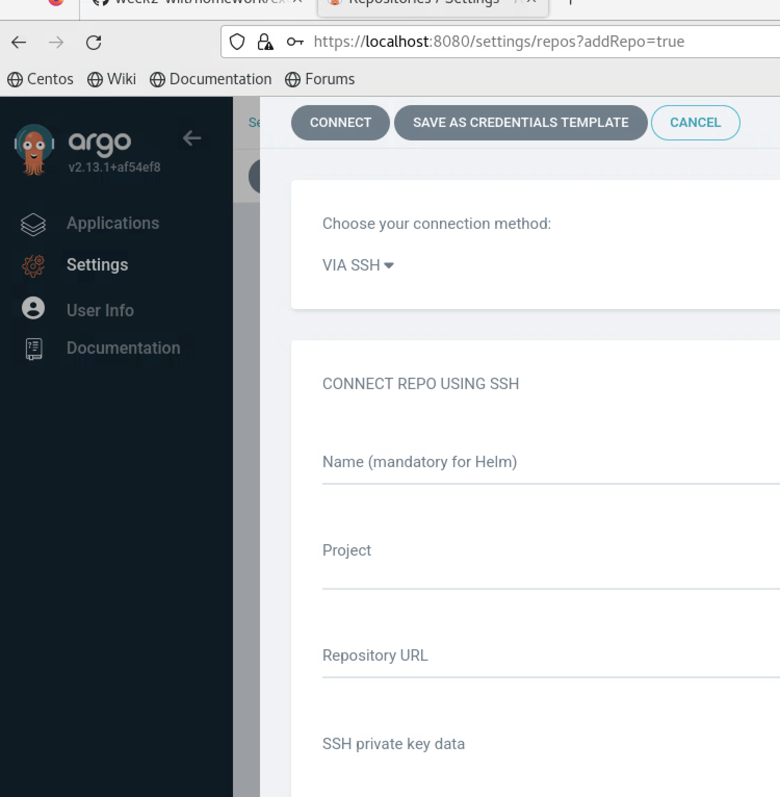
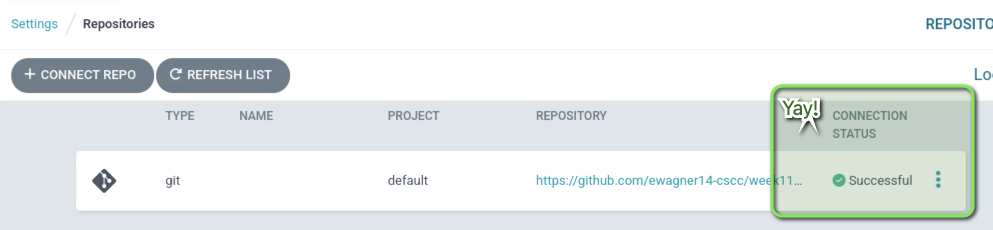
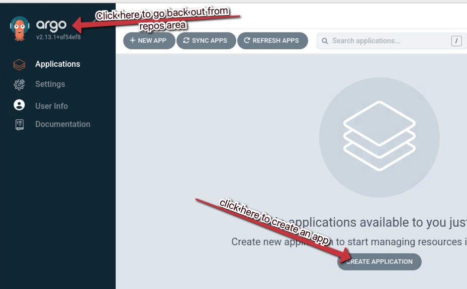
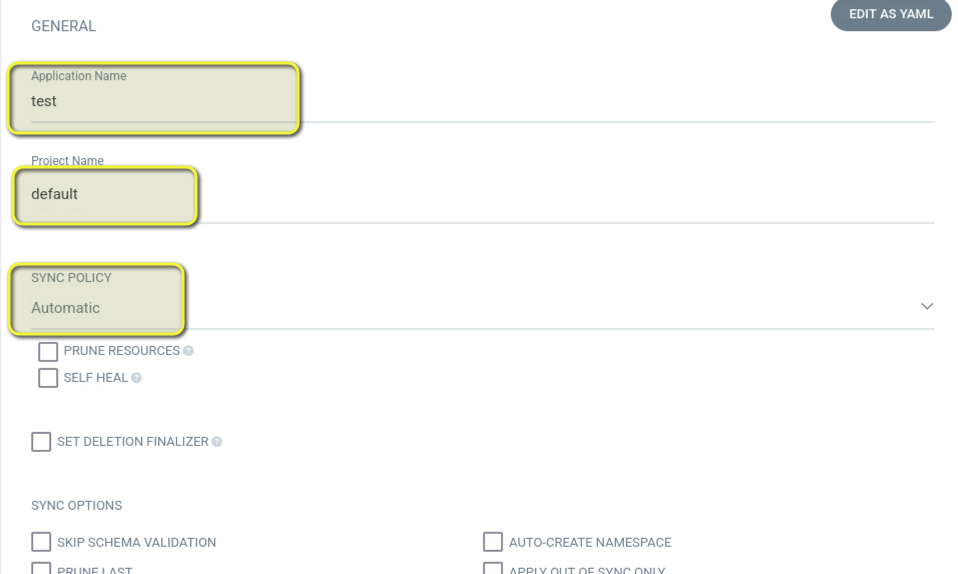
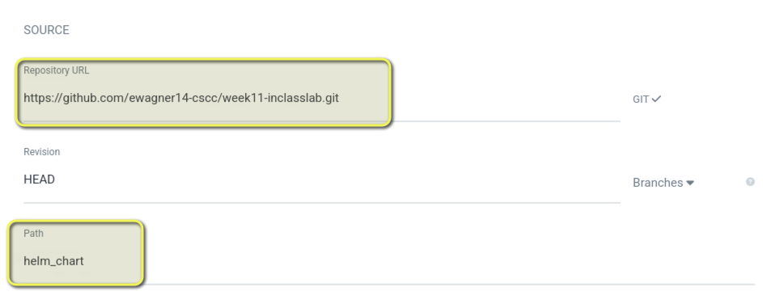
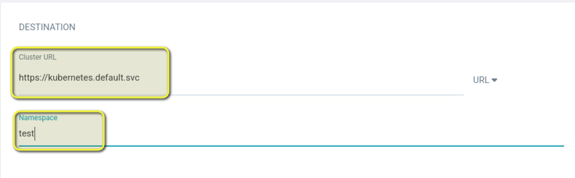
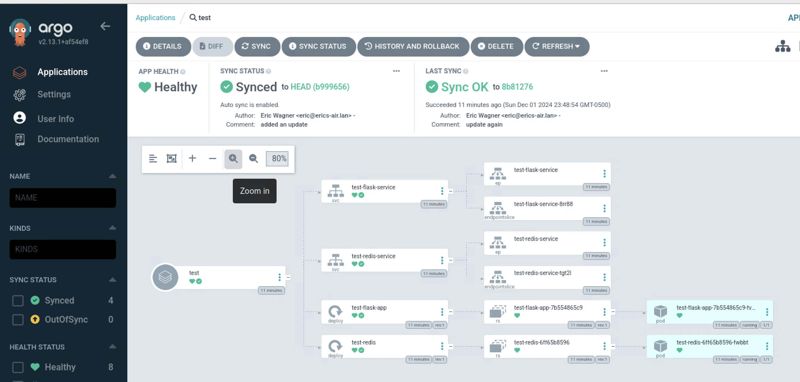

# week 11 inclass activity

from docker to CI/CD

We are going to be using python, Dockerfile, kubernetes services and deployments, helm, and finally CI/CD with ArgoCD.

If you are using the CSCC vms, you should start with a fresh working copy of minikube

```bash
minikube stop
minikube delete
minikube start --container-runtime=docker --kubernetes-version=1.28.3

#or all together

minikube stop && minikube delete && minikube start --container-runtime=docker --kubernetes-version=1.28.3

```

## docker stuff

build the image

run the image

```bash
docker run -p 5001:5000 flask-app:latest
```

## k8s stuff

create a pull secret

```bash
kubectl create secret docker-registry acr-pull-secret \
    --docker-server=week9wiit7501.azurecr.io \
    --docker-username=week9wiit7501 \
    --docker-password=<DERP> \
    --docker-email=ewagner14@cscc.edu
```

Could even add the secret creation to your github CI and fetch from a Key Vault

```yaml
- name: Fetch ACR Password from Azure Key Vault
  uses: azure/secrets-store-csi-driver-provider-azure@v1
  with:
    keyvault-name: ${{ secrets.AZURE_KEYVAULT_NAME }}
    secret-name: acr-password
    tenant-id: ${{ secrets.AZURE_TENANT_ID }}

- name: Create Kubernetes Pull Secret
  run: |
    kubectl create secret docker-registry acr-pull-secret \
      --docker-server=${{ env.ACR_HOST }} \
      --docker-username=${{ secrets.DOCKER_USER }} \
      --docker-password=$ACR_PASSWORD \
      --docker-email=user@example.com
```

## helm stuff

delete the templates dir

add to the values file

replace all the services labels with {{ .Release.Name }}

## argocd stuff

```bash
helm repo add argo https://argoproj.github.io/argo-helm
helm repo update
kubectl create namespace argocd
helm install argocd argo/argo-cd --namespace argocd


```


youll get instructions to get the admin user password

```bash
kubectl -n argocd get secret argocd-initial-admin-secret -o jsonpath="{.data.password}" | base64 -d
```

in another terminal, kubectl port-forward to the argocd service

```bash
kubectl port-forward service/argocd-server -n argocd 8080:443
```

lets also create a new pull secret and new namespace for our app

```bash
kubectl create ns test
kubectl create secret docker-registry acr-pull-secret-argocd -n test \
    --docker-server=week9wiit7501.azurecr.io \
    --docker-username=week9wiit7501 \
    --docker-password=<DERP> \
    --docker-email=ewagner14@cscc.edu

```

Lets add to the helm chart and update the values pull secret

### argocd ui

#### setting up a repo

first get logged into argocd

now click into the settings menu



then click repos



Then click connect repo, and you will get a screen like this



In this menu will want to fill out the following

- choose your connection method
  - click drop down, and select "via HTTPS"
- Project
  - select default
- Repository URL
  - paste your GitHub repo (ex: https://github.com/ewagner14-cscc/week11-inclasslab.git)

Then click connect

You should see a Successful connection status



#### setting up the helm chart

Click back out to the main argocd app

And the click on the "create application" button



A lot of options in the next menu screen. Fill out the following in the labeled sections

The first section is "General"

- App name
  - test
- Project name
  - default
- Sync policy
  - click drop down and select "Automatic"



The next section is source.

- Repo URL
  - Click the drop down and you will be able to select the repo we added
- path
  - type in the path of the helm chart in the GitHub repo (ex: helm_chart)



The next section is destination settings. Here we select the local k8s cluster in the minikube and the namespace.

- cluster URL
  - https://kubernetes.default.svc
- namespace
  - test



We do not need to edit the helm chart area. It should be good.

#### deploy!

If your test namespace is created and you have the argocd image pull secret ready, you should be good to go.

